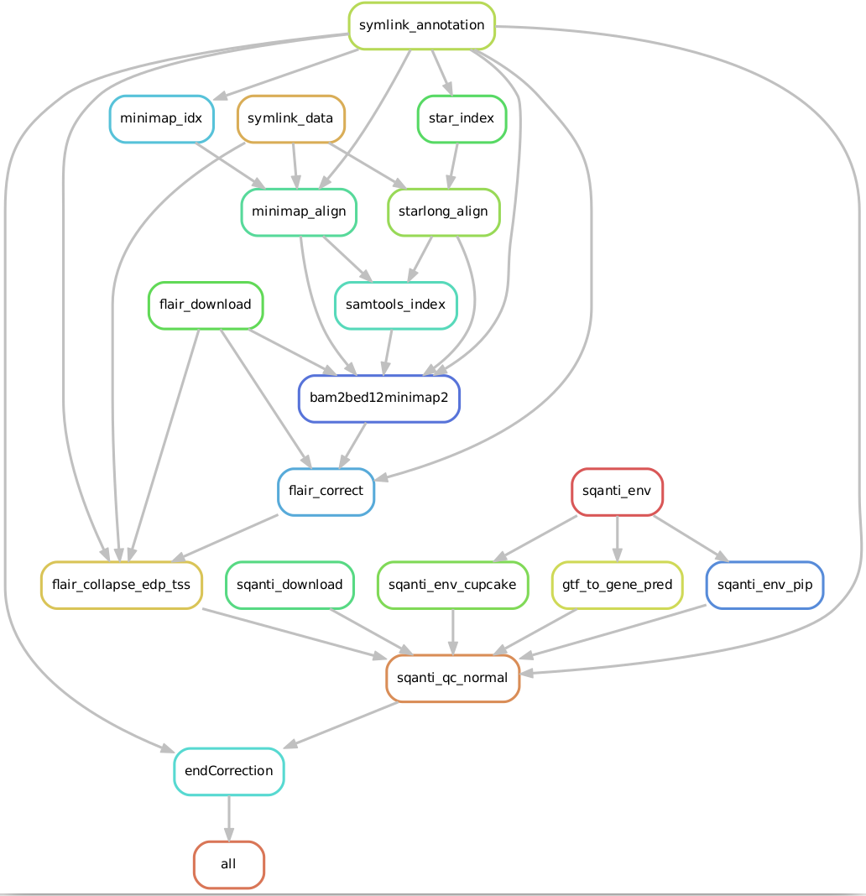

.. CIA Transcriptome Assembly documentation master file, created by
   sphinx-quickstart on Wed Feb 22 16:03:05 2023.
   You can adapt this file completely to your liking, but it should at least
   contain the root `toctree` directive.

Welcome to CIA Transcriptome Assembly's documentation!
======================================================

.. toctree::
   :maxdepth: 2
   :caption: Contents:

Overview
--------

The CIA Transcriptome Assembly pipeline is a custom Snakemake pipeline designed
to map long-read mRNA or cDNA-seq data and build transcriptome annotations from
in a robust manner. It accepts FASTQ files from ONT Direct RNA-seq, 
ONT PCR-cDNA, PacBio Iso-Seq, or FLAM-seq as input. 

It uses `FLAIR <https://github.com/BrooksLabUCSC/flair>`_, 
`SQANTI <https://github.com/ConesaLab/SQANTI>`_, and a custom end correction
step to build the annotations with high resolution.  

This software accompanies Alfonso-Gonzalez et al., Cell, 2023 *TODO INSERT
DOI HERE*. 

Software/hardware requirements
------------------------------

The CIA Transcriptome Assembly has been tested on CentOS 7.7 and Ubuntu 22.04 
LTS and should work on most Linux64 platforms. At least 32GB of memory are 
required for the STAR alignment step. 

Getting started
---------------

Download and install ``conda`` from 
`here <https://docs.conda.io/en/latest/miniconda.html>`_. Then execute
``make env`` from the base directory to make the base snakemake environment. 
This will result in an environment called ``snakemake-cia``. If you need
to remove the conda environment, execute ``make clean-env``. 

All other software will be installed via conda or during the runtime of the 
pipeline. 

Testing the pipeline
--------------------

To ensure that the pipeline can successfully run on your machine, we have 
provided a dataset consisting of four files, one from each experimental type,
that can be downloaded from `Zenodo <https://doi.org/10.5281/zenodo.7438383>`_.

To automatically download this dataset and run it, simply run ``make test`` 
which will run ``make env`` as described above if necessary, 
download and build the Drosophila annotation, the Zenodo dataset, 
and unpack and run it using the ``test.sh`` snakemake command. 

Configuration
-------------

Two files in the config directory control most of the behavior of the 
pipeline: ``units.tsv`` and ``config/config.yaml``. ``units.tsv`` contains
three columns: ``sample``, ``path``, and ``sample_type``. ``sample`` is simply
a unique identifier for the sample during the pipeline, ``path`` is 
the path to the demultiplexed FASTQ file of the respective sample (can be 
outside the current directory, will be symlinked into ``data/`` at runtime)
and ``sample_type`` can be one of ``flam-seq``, ``iso-seq``, ``ont-direct``, or
``ont-cdna``. 

Annotation file specifications
------------------------------

Several additional files specify the annotations. 

These include the primary genome assembly (FASTA) and gene annotations (gtf), 
which can be downloaded from e.g. ENSEMBL. 

For Drosophila, the command ``make drosophila_annotation`` will automatically
fetch and download the files used in running the pipeline for the publication 
(Ensembl dm6, build 79). For other organisms, the primary
genome assembly and annotations can be fetched from ENSEMBL, and 
using the 
`UCSC toolkit <https://genome.ucsc.edu/goldenPath/help/twoBit.html>`_ as 
documented will generate the required ``genome.chrom.sizes`` file: 

:: 

   faToTwoBit genome.fa genome.2bit
   twoBitInfo genome.2bit stdout | sort -k2rn > genome.chrom.sizes

These tools are installed into the `cia-snakemake` environment upon
environment creation. 

In addition to the canonical annotation files, several additional files are
used. The files corresponding to Drosophila are included in the ``db/`` folder
in the repository, but will need to be created for other organisms/genome builds.  

#. combined.rds.clusters.new.gff
#. promoter.db.edp12.bed
#. splice_junctions_filtered.tab
#. sqanti.polya.list

**TODO: CARLOS IN HOW TO CREATE THESE FILES AND WHERE THEY COME FROM**

The default location for these is in the ``db`` directory, but they can be 
specified in ``config/config.yaml`` as key: value pairs. For example,

::

   annotation: 
      genome.fasta: /data/repository/organisms/dm6_ensembl/genome_fasta/genome.fa

will symlink from the specified the path to ``annotation/genome.fasta``. 

Pipeline overview
-----------------

#. The first steps are to symlink the data and annotation from those specified .
   during configuration to the ``annotation`` and ``data`` directories 
   respectively. 
#. Minimap and STAR indices are created in the ``index`` directories.
#. Minimap or STARlong are used to map the reads, depending on the
   mapper variable associated with the sample type in ``config/config.yaml``. 
   By default, FLAM-seq and Iso-seq use STARlong (as used in 
   `the FLAM-seq protocol <https://www.nature.com/articles/s41592-019-0503-y>`_)
   whereas the Nanopore protocols use minimap with the `-ax splice -uf` options.
#. The resulting BAM file is indexed. 
#. The BAM file is converted to BED12 format. 
#. Environments for FLAIR and SQANTI are set up manually. Note that SQANTI uses
   the ``sqanti_git_commit`` specified in ``config/config.yaml`` to ensure
   that the pipeline matches the . 
#. FLAIR is used to correct misaligned splice sites from the BED12 file 
   using genome annotations. 
#. FLAIR is used to collapse corrected reads into high-confidence isoforms. 
#. The ``R/RDSFLAM.endGuidedCorrection.R`` is used to correct the ends using
Nanopore direct RNA-seq or FLAM-seq data. 

Please refer to the STAR Methods in Alfonso-Gonzalez et al. for further details.

End correction
--------------
The end correction script at the end uses FLAM-seq and Nanopore direct RNA-seq 
to correct the SQANTI-annotated isoforms. These are specified either in 
``db/combined.rds.clusters.new.gff`` or can be generated with the pipeline.

**TODO ask Carlos about chicken and egg problem**

Indices and tables
==================

* :ref:`genindex`
* :ref:`modindex`
* :ref:`search`
